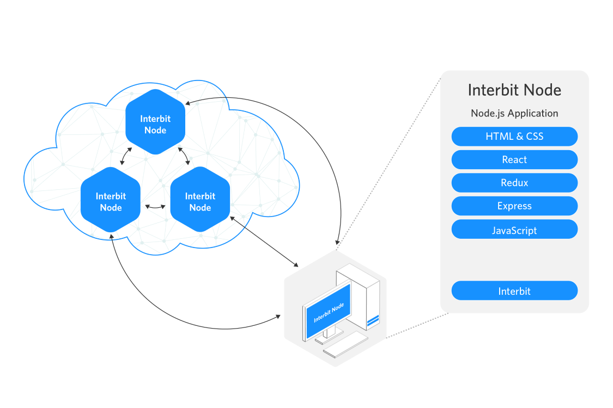
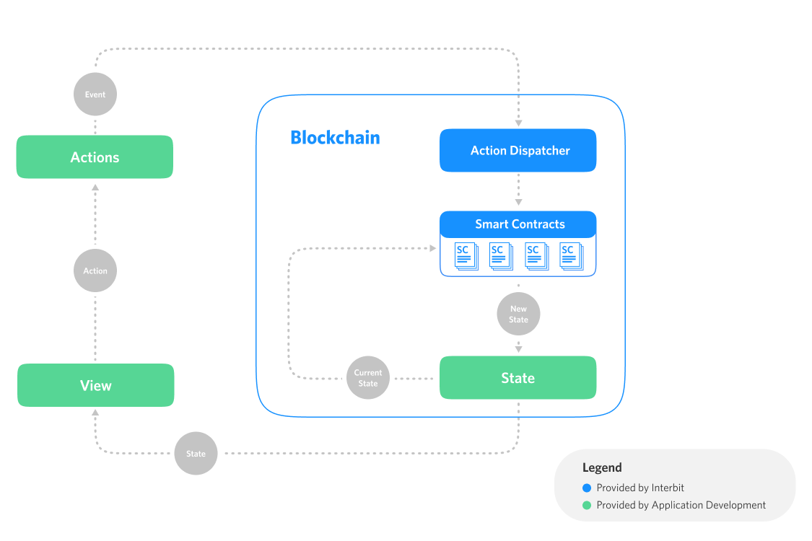

# Architecture

Interbit’s design, architecture, and componentry use popular, modern technologies and patterns, ensuring developers enjoy a familiar experience developing in a common programming language, and have vibrant communities to draw upon for support.

  
TODO

  <ul>
    <li>What about app architecture?</li>
    <li>Multi layered validation</li>
    <li>Syncing chain state with UI</li>
    <li>Responding nicely to dispatches &amp; blocking times</li>
    <li>What about multi-chain architecture?</li>
    <li>Atoms &amp; Molecules</li>
    <li>Considerations while architecting your molecule</li>
    <li>Architecture/molecular design patterns</li>
    <li>Existing implmentations of these patterns (??)</li>
  </ul>

## Technology

The major technologies used in Interbit (and applications powered by Interbit) are shown in the following diagram.

 

 

## Redux

Interbit is implemented using the Redux design pattern. The following diagram shows how the traditional Redux elements appear within an application powered by Interbit.

