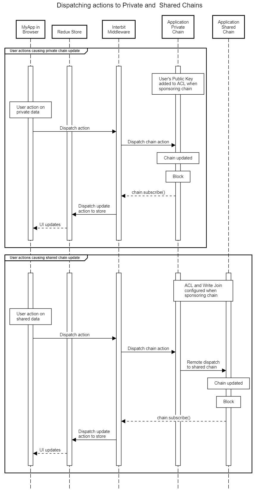

# Public/Private/Control Architectural Model

The Interbit **Public/Private/Control (PPC)** architectural model is intended as a template for building Interbit applications that respect user's privacy.

The PPC model is used within the [Interbit Accounts](https://accounts.interbit.io) so that each user will have their own private chain to ensure privacy of their personal data. It is also implemented in the *template* to enable developers to implement PPC applications that ensure user data privacy.

The PPC model also enables *Chain Authorization* where users can authorize secure data sharing of their personal data in their private accounts chain with their private application chains.

### Chain Roles within the PPC Model

The PPC model defines specific roles for Public, Private and Control chains, but can be expanded to include chains for sharing data between users. The responsibilities of the specific chains in the PPC model are:

**Public Chain**: Every user can load the public chain. The public chain contains the configuration required to create new private chains when a user launches the application.

**Private Chain**: Each user has their own private chain for privacy, and only the owner can load and interact with that chain. The ACL of the private chain will be restricted, typically containing the public key(s) of the chain's owner and the chain ID of the control chain that created it.

**Control Chain**: This is the administrative chain that manages the creation of private chains and is the source of truth of system data on the public chain (shared via a read join). Only administrators have access to this chain. Because this chain contain information on the private chains that it creates (join configuration or block history), it is a potential source of metadata leakage and should not be loaded on users browsers.

**Shared Chains**: Many applications will require a chain or chains that *authorized* users can interact with by dispatching actions. Actions can be dispatched to this chain directly (if the user's public key is added to the chain's ACL) or indirectly (through a write join from the user's private chain). The shared chain is analogous to traditional shared public blockchains.

## How the PPC model enables private user chains

Private chains are created using *Chain Sponsorship*. If the user does not have a private chain in the browser's local storage, *Interbit Middleware* running on the browser can create a private chain and add the user's private key to the ACL of the new chain.

Dispatching actions to a shared application chain is enabled by configuring a write join between the user's private chain and the shared chain during the chain sponsorship process (it is also possible to use the sponsorship process to add the user's public key to the chain's ACL).
This sequence diagram shows how private chains are created:

[View the diagram at *sequencediagram.org*](http://sequencediagram.org/index.html#initialData=C4S2BsFMAIGECdIENQDsDm0nQArxAG4oywAWSIq0l0wpMOOs0AsgPYAmk4AUAA5J4oAMYgBqYNABEASQmR4AIzCsQHDlADugyAB0qNAELw2mgM4LoAQT58pWM9GOmL8foJFikE6Tb7gQYRQQNlR9HABXRQDhOHJKeyRHP0jFdyFArx8pPxjg0PD8ImA9VDIKVETk2zxCdM9xSRzbPNACstDgE3A4iv0ACngI1FRKTFDoVwJLVE5IAEoq61tYTu6eMwFhSB4kYVBimD9ViXW9g+JlvlSeRTYAD2g2afgrk662cAAuaAAZNiQHGgwlCADMQJhQSYALb6SCoAggEyoaHw4A8Y5rT4AWgAfCkoj8AMrkRDQUhsMxoTAcFDYQbIIEAKzYlHmGy2Oy450IlwJaW5+15JTeWN4AF5xQBVABKvx+pGAwD4Zi+AHo1SwAJ5+AB0IOhkt2QsOThM5gUtweTxeZpcCmJwA80DkJSUYH0AAktXwFIizGx4GrYL8ZDxnBb4Hj+T9-oDepRjRcRfyMTUoti8RHXD8ZYzgfEwqgKVSxtBaU6rY9npZsw64IhLgBxeGQMwgRwncHofRWdTQPhRGLQADWkC1tDY1hD+gAIpBwagYAApVmoMz6BDIEUtpftxyGcBsYQj8Pm1zRlZi4nwoHlGjAKdEvihANuHmmzGnT5Vm2WL8fN80AAGpIAEFYwOgrb7tA0THiO+jeMya7AmCEJpnw7zdHiABUKRFD8W7EPofBFJcwiFhyew7B+fI1EUGFYTi+L0YQsYAneNaoN46IAdhLHXARcBoegERkiylBmIxYqXoJbHQFKfAQdOvy-jWrz4fJtSmhRfSjI4JYlECSH6EEVCKDAR6ApAHBUdsPCCsmRysQQDnICadGYWKblUiYWrtlAPh8T+dZRgJ2nsfG96oEmwrOXJrmaQQma4qFxJRGYwj4BZk4FhU0AREpxBSXc1a2klPyHvBam2mluBkSKuk0B20CzJo+hwSeYwADTQFZXDGagHD6I2HATqCgYFRYZ72mFFXQLOHYCMAFFYEKr52Vy7lOVc2lubRKbpgK21xXakY8EAA)

## How the PPC model routes updates to private and shared chains

The PPC model and the *Interbit Middleware* permit applications to dispatch actions to private and shared chains. Specifically, *Chain Sponsorship* is used to manage the ACL updates and other configuration required to allow users to successfully dispatch actions to a permissioned blockchain while ensuring that private keys never leave the user's device.

Once configured, *Interbit Middleware* mediates routes actions dispatched from the application to the appropriate chain using a friendly chain alias. It also subscribes to chain updates and updates the application's redux store.

[View the diagram at *sequencediagram.org*](http://sequencediagram.org/index.html#initialData=C4S2BsFMAIBEQM4AcCGwDGALEA7A5tCuqAPY4LTAnQAKATiAG5owo4Am00AypinZE4BhPrgQAoVHVDoQqHMGgAiALIBPAIJIk0XAB0cAITokA7gkh0lhCsbMW6k-jLltFSgEqCArgA8eVALWKBRe7H5O0iCy8u4AkgqWAEZgBiog7OxQpvyQwRTpmdm5kS6xylpI4NFoIGQG9EwsBiIouPnQlY2MpdGuChXa1ei19Ti8uewtojgdlRMC7L0xboNVNaQ4DQzMwJDTbbM2ndrd4ngm3joAqg6ExHXk0CPeCLgESDsszzPQV+wscTIIiQcREUC7GB2cyWMEPSHQMIRcFNPbQQpZSA5ARwiHfLo7cRJEj+EiMSwnJDdABc0FulgA5BQaN4ksNoABpSBqAwoTKCSjUDRCAAy0FMmEgW3ISDICBIDHwP0ORJJ0DJFOhDlp9Lo9026uln1RMABwBQ4i1lgAtAA+DHFAS0+DAjCYfWPcQOrG5O0EpjOxCoN3K3Aesiq0nkvX+xi01ph-4sJbEqMU2O0wzgEjoADW4lj1rt3uxkFpWEOADoEKyEOgGElIAAKACUXoymNLdqRvkDrqwfyQZv2OBRZEF0AQgVBPaLtqtdB1cUHw4kwPQoPYkBRCNj4i3O++JZKB-h3x7++3Z7RC-EUqWFxIVzpdzHTxebyVCD4i1DOBXgLrqCh43iYMKOCBMAXpB6Ido6wHXjAe4wfMP6CJG6rRpS3QADSoZMtLCmKbCcAA6gwaIAFIkPoODoGQABmIB4N4v4SlKBjIHKCrvH+GEanqC46q+DzjmM36TNAZoWguxZwT6TpwEGaADm+7ZFApkB+qcOx9sGA4VmGamFra+GLLSXgALYkGi7DKW6BhUJOaGcIZOD8VhZmCPGvxJnsKZqgJlILN50BZjm+Zeewc7HopbnVrW9YgI2rbqZ2vq2j2ekqe6fkjm+E5TgqM4+L4c5CXSy55WuqAbpeKE6Uw9WIcFLnNXiaKxZuV4dVBpXtSaYVgQ4d4cEAA)

## Chain Authorization (cAuth) in the PPC Model

The PPC model and the template are designed to enable Chain Authorization (cAuth). Chain Authorization gives the user fine grained control over how and where their private data is shared and used with other Interbit applications.

Chain authorization requires the user to explictly opt-in to the creation of a read join between their private accounts chain and a chain in another application, typically a private chain created for the user by the application. Setting up the join is a multi-step process, requiring the generation of an unguessable join name and configuration of the join provider in the Interbit Accounts application, then the configuration of the join consumer in the application requesting Chain Authorization.

The PPC template implements a cAuth loop with Interbit Accounts.

[View the diagram at *sequencediagram.org*](http://sequencediagram.org/index.html#initialData=C4S2BsFMAIGEAsCGIB20CCBXY8D2AnEAL0VFzVWhxgAUbZoBZXAE0nACgAHRfUAYxA8UwaACJGAT3Rcu0VAB0UAIXy4A7gGdI+MdESboqjdvzdeAoYhHiZXcCH6kQ5JTUIA3UpCUJkKPQMMWXcQD3M+RysbMXR+flxMEUNFFTUtHUDDOISk4E0Iy2FRWPjE5LdPb18kVCyMMrzNUPCAXlaAVQAlABkALmh4YGAuTT6AenGpOwA6BIBbdo5EflAvYBhjDLMVte9grhaOOxaAWlOAPi3TAa7IRBZ9bDxCEjI0TWBSTE0lAAoAJKGRCyaBcKobaD8WpoABWuFQkEewFwSh+OkM4LC+xWuWSUJhAEoOJoePxIBw2LtsZCTp4ONcdJccuV8rckSB8JBVtAAEbpUxUXDQJRDEZjSa41maGaoDb4XlgWXCpQ8TSaVAAczBEJg0P80ABLEp91WNM2Ap0HHa3X6g2Gowm4yleVlIh0iuAyqWpJWFOp6xgLKax0ayWZYfyLQGPVwDwJ-mWZsDDTxUfpweSZwjabGd3jiGekBEjmc5Ggn2+vxQgMMAHEwAAJTC8nW4ABmICg8hQ7eFqRdNixKf1qGJXPb0FwHh0qelfSw1BLTkh6jA8GgDeAzd5-wBk5QuFEhaXAm8LGJvNwAA8pzP8HOmgN0JoANbQdEPlH6WRqGcilB4UoLkAEdMEgT5oD7fAlGoTkdXNaAWFIRBQ1zHNpWjWByE7TVMC5fRI2rLl4yAtBwWnEA2DMTN0zCc4LlovN7keAApBE0AAOUQeYKSYy5GXwdkWE5blRF5FZ32-JxwAcFBtQ1Vd1yUJjoBafY-EoI19BQNiOOgbjeJNAN9iYo4qWTUyiOtTpegGMVHUmaZZDmXBFlaJM9khQTPMQsz6UE5kQk8PpY3jTSUF8lM6TCBlLXwILDhC7DexAPCCMHfJoBIx4yKhchNEwXizF9ckOCvW9p1nGKPAAGn8sI+nzXL9MPdR8tS9KkT5SBgHUSBiw-UwAHJq1U9TIWsR47AcFcXDQCa9RhApSopCyvKDYLYvWvyiPM00NqMeKOCAA)
