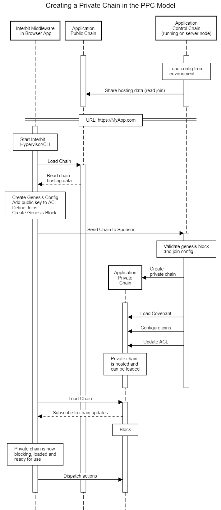
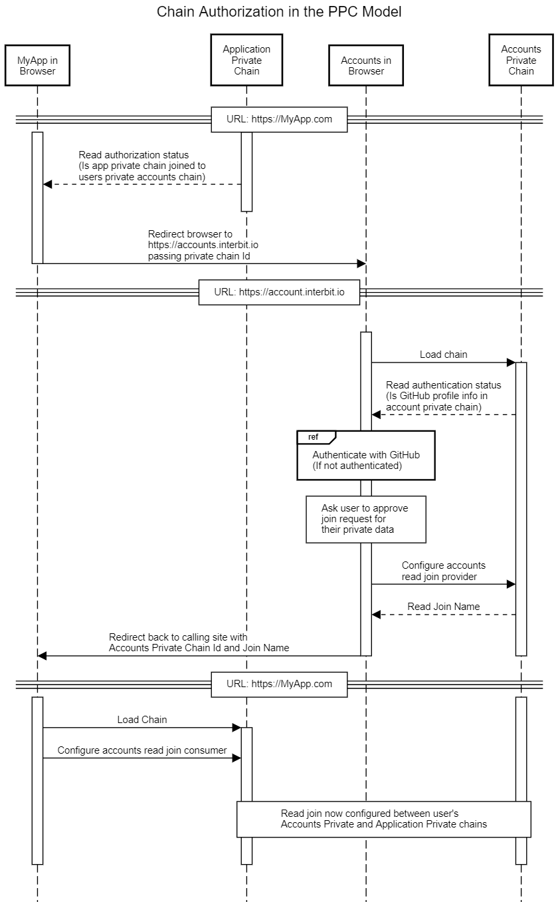

# Public/Private/Control Architectural Model

The Interbit **Public/Private/Control (PPC)** architectural model is intended as a template for building Interbit applications that respect user privacy.

The PPC model is used within the [Interbit Accounts](https://accounts.interbit.io) so that each user will have their own private chain to ensure privacy of their personal data. However, the PPC model is intended as a general application design pattern and is built into the Interbit application template to make it easier for developers to implement applications that ensure user data privacy.

The PPC model also enables [Chain Authorization (cAuth)](#chain-authorization-cauth-in-the-ppc-model) where users can authorize secure data sharing of personal data between their private accounts chain and private application chains.

### Chain Roles within the PPC Model

The PPC model defines specific roles for Public, Private and Control chains. The responsibilities of the specific chains in the PPC model are:

**Public Chain**: Every user can load the public chain. The public chain is read only and contains the configuration required to create new private chains when a user launches the application.

**Private Chain**: Each user has their own private chain for privacy, and only the owner can load and dispatch actions to that chain. The ACL of the private chain will be restricted, typically containing the public key(s) of the chain's owner and the chain ID of the control chain that created it.

**Control Chain**: This is the administrative chain that manages the creation of private chains and is the source of truth of system data on the public chain (shared via a read join). Because this chain will contain information on all of the private chains that it creates (in the join configuration and block history), it is a potential source of metadata leakage and should not be made accessible to users without careful consideration.

*Note: One case where intentional metadata leakage may be desirable is a pseudonymous sharing model where chain IDs allow users to see the extent of the user pool and who they are interacting with, but without sharing personal data.*

Chains in applications build using the PPC pattern are not limited to these three roles. A common requirement is for one or more [shared chains](#extending-the-ppc-model-to-include-shared-chains).

## How the PPC model enables private user chains

Private chains are created using [Chain Sponsorship](../reference/interbit-middleware/chainSponsorship.md). If the user does not have a private chain in the browser's local storage, [Interbit Middleware](../reference/interbit-middleware/middleware.md) running on the browser can create a private chain and add the user's private key to the ACL of the new chain.

Dispatching actions to a shared application chain is enabled by configuring a write join between the user's private chain and the shared chain during the chain sponsorship process (it is also possible to use the sponsorship process to add the user's public key to the chain's ACL).

This sequence diagram shows how private chains are created.

[View the diagram at *sequencediagram.org*](http://sequencediagram.org/index.html#initialData=C4S2BsFMAIGECdIENQDsDm0nQArxAG4oywAWSIq0l0wpMOOs0AsgPYAmk4AUAA5J4oAMYgBqYNABEASQmR4AIzCsQHDlADugyAB0qNAELw2mgM4LoAQT58pWM9GOmL8foJFikE6Tb7gQYRQQNlR9HABXRQDhOHJKeyRHP0jFdyFArx8pPxjg0PD8ImA9VDIKVETk2zxCdM9xSRzbPNACstDgE3A4iv0ACngI1FRKTFDoVwJLVE5IAEoq61tYTu6eMwFhSB4kYVBimD9ViXW9g+JlvlSeRTYAD2g2afgrk662cAAuaAAZNiQHGgwlCADMQJhQSYALb6SCoAggEyoaHw4A8Y5rT4AWgAfCkoj8AMrkRDQUhsMxoTAcFDYQbIIEAKzYlHmGy2Oy450IlwJaW5+15JTeWN4AF5xQBVABKvx+pGAwD4Zi+AHo1SwAJ5+AB0IOhkt2QsOThM5gUtweTxeZpcCmJwA80DkJSUYH0AAktXwFIizGx4GrYL8ZDxnBb4Hj+T9-oDepRjRcRfyMTUoti8RHXD8ZYzgfEwqgKVSxtBaU6rY9npZsw64IhLgBxeGQMwgRwncHofRWdTQPhRGLQADWkC1tDY1hD+gAIpBwagYAApVmoMz6BDIEUtpftxyGcBsYQj8Pm1zRlZi4nwoHlGjAKdEvihANuHmmzGnT5Vm2WL8fN80AAGpIAEFYwOgrb7tA0THiO+jeMya7AmCEJpnw7zdHiABUKRFD8W7EPofBFJcwiFhyew7B+fI1EUGFYTi+L0YQsYAneNaoN46IAdhLHXARcBoegERkiylBmIxYqXoJbHQFKfAQdOvy-jWrz4fJtSmhRfSjI4JYlECSH6EEVCKDAR6ApAHBUdsPCCsmRysQQDnICadGYWKblUiYWrtlAPh8T+dZRgJ2nsfG96oEmwrOXJrmaQQma4qFxJRGYwj4BZk4FhU0AREpxBSXc1a2klPyHvBam2mluBkSKuk0B20CzJo+hwSeYwADTQFZXDGagHD6I2HATqCgYFRYZ72mFFXQLOHYCMAFFYEKr52Vy7lOVc2lubRKbpgK21xXakY8EAA)

## Dispatching actions to private chains

The PPC model and the *Interbit Middleware* permit applications to dispatch actions to private and shared chains. Specifically, *Chain Sponsorship* is used to manage the ACL updates and other configuration required to allow users to successfully dispatch actions to a permissioned blockchain while ensuring that private keys never leave the user's device.

Once configured, *Interbit Middleware* routes actions dispatched from the application to the appropriate chain using a friendly chain alias to identify the chain. It also subscribes to chain updates and updates the application's redux store.

[View the diagram at *sequencediagram.org*](http://sequencediagram.org/index.html#initialData=C4S2BsFMAIBEQM4AcCGwDGALEA7A5tCuqAPY4LTAnQAKATiAG5owDCmKuCAUKnaOhCocwaACIAsgE8AgkiTRcAHRwAhOiQDuCSHTGEK6rTrq8U-EIOGixAJUgATAK4APaAGUqdSPpQV7zi5mFlYoIuIAkiK6AEZgKhIgDg5QmuY+BtCJyanpwQJCYTZySOCWaCBkKvRMLCrsnDi+FCU1jNxEoMzAMEbauh3EtT3QAa6DXSxZSSmQad4TwzCtDO0xJG4kjLrQK0wAXNAAqiYA5BQ0TjFl6NAA0pBSKijJjpTUMqwAMtCamJA4FTIMgIEgMfDQLCNbjrTbbOjQPomQ4nHadSo4aBVHBIVZTBxoFDcJG6AC0AD5srN5pBDvBkGgsIQhmRuFTct4KXtGHTEKgMJhIRxcMzSDgYRssfDdvI2ocGiKnEgCT0HBK4TtuYdVOASOgANbcbmkinsubpQ5Q3AAOgQVwQ6AYMUgAAoAJRsmYcyAUsYuXkMgXQJUqyDPFmYqjQBBeSDcP0m8kkugoiLB5UsHgM9BxhyQdHdZay1bcPMFqZmmml-NDQujRzjMu1qbJ7hAA)

## Chain Authorization (cAuth) in the PPC Model

The PPC model and the template are designed to enable Chain Authorization (cAuth). Chain Authorization gives the user fine grained control over how and where their private data is shared and used with other Interbit applications.

Chain authorization requires the user to explictly opt-in to the creation of a read join between their private accounts chain and a chain in another application, typically a private chain created for the user by the application. Setting up the join is a multi-step process, requiring the generation of an unguessable join name and configuration of the join provider in the Interbit Accounts application, then the configuration of the join consumer in the application requesting Chain Authorization.

The PPC template implements a cAuth loop with Interbit Accounts.

[View the diagram at *sequencediagram.org*](http://sequencediagram.org/index.html#initialData=C4S2BsFMAIGEAsCGIB20CCBXY8D2AnEAL0VFzVWhxgAUbZoBZXAE0nACgAHRfUAYxA8UwaACJGAT3Rcu0VAB0UAIXy4A7gGdI+MdESboqjdvzdeAoYhHiZXcCH6kQ5JTUIA3UpCUJkKPQMMWXcQD3M+RysbMXR+flxMEUNFFTUtHUDDOISk4E0Iy2FRWPjE5LdPb18kVCyMMrzNUPCAXlaAVQAlABkALmh4YGAuTT6AenGpOwA6BIBbdo5EflAvYBhjDLMVte9grhaOOxaAWlOAPi3TAa7IRBZ9bDxCEjI0TWBSTE0lAAoAJKGRCyaBcKobaD8WpoABWuFQkEewFwSh+OkM4LC+xWuWSUJhAEoOJoePxIBw2LtsZCTp4ONcdJccuV8rckSB8JBVtAAEbpUxUXDQJRDEZjSa41maGaoDb4XlgWXCpQ8TSaVAAczBEJg0P80ABLEp91WNM2Ap0HHa3X6g2Gowm4yleVlIh0iuAyqWpJWFOp6xgLKax0ayWZYfyLQGPVwDwJ-mWZsDDTxUfpweSZwjabGd3jiGekBEjmc5Ggn2+vxQgMMAHEwAAJTC8nW4ABmICg8hQ7eFqRdNixKf1qGJXPb0FwHh0qelfSw1BLTkh6jA8GgDeAzd5-wBk5QuFEhaXAm8LGJvNwAA8pzP8HOmgN0JoANbQdEPlH6WRqGcilB4UoLkAEdMEgT5oD7fAlGoTkdXNaAWFIRBQ1zHNpWjWByE7TVMC5fRI2rLl4yAtBwWnEA2DMTN0zCc4LlovN7keAApBE0AAOUQeYKSYy5GXwdkWE5blRF5FZ32-JxwAcFBtQ1Vd1yUJjoBafY-EoI19BQNiOOgbjeJNAN9iYo4qWTUyiOtTpegGMVHUmaZZDmXBFlaJM9khQTPMQsz6UE5kQk8PpY3jTSUF8lM6TCBlLXwILDhC7DexAPCCMHfJoBIx4yKhchNEwXizF9ckOCvW9p1nGKPAAGn8sI+nzXL9MPdR8tS9KkT5SBgHUSBiw-UwAHJq1U9TIWsR47AcFcXDQCa9RhApSopCyvKDYLYvWvyiPM00NqMeKOCAA)

## Extending the PPC model to include Shared Chains

Many applications will require a chain or chains that all *authorized* users can update by dispatching actions. Such shared chains are analogous to traditional shared public blockchains.

The additional chain responsibilities added to the PPC model are:

**Shared Chains**: The data in these chains are either shared by all users of the application, or specific user groups. All authorized users can load and dispatch actions to the chain.

### Dispatching actions to shared chains

Extending the PPC model to permit users to dispatch actions to a shared chain requires additional setup during the chain sponsorship process when private user chains are created. There are two ways that user actions can be dispatched to a shared chain:

1. **Direct**: Authorized users dispatch actions directly to the shared chain. During chain sponsorship, the control chain dispatches an action to the shared chain to add the user's public key to the shared chain's ACL.

2. **Indirect (write join)**: Users dispatch actions to their private chain, triggering a remote redispatch to the shared chain. During chain sponsorship, the control chain dispatches actions to the private and shared chains to configure a write join between them.

This sequence diagram shows how actions are dispatched to the shared chain using the Indirect (write join) method:

[View the diagram at *sequencediagram.org*](http://sequencediagram.org/index.html#initialData=C4S2BsFMAIBEQM4AcCGwDGALEA7A5tCuqAPY4LTAnTQDKmKATpACbQDCDuCAUKo6HQhUOYNABEAWQCeAQSRJouADo4AQoxIB3BJEbjCFDdt2M+TQcJSiJAJVYBXAB50qzAygr2Wz8wJBCImLiAJKiegBGYKqSICwsUFpMkB4UsfGJyX6WQRLySOABaCBkqgAKjCAAbmiQqpwouKnQ+RXV2QFWNuL5hejFpTj0ySz1XDjN+cPMLDxEoDXAMMY6enPE1bXQ3r7zm0vQ6QmQSczrC1utlVXn+zBTDDM8ESQuJFV6LQptVQA0DyMAFwtdgAGUIODYAHVKgcAFIkFQ4dBkABmIDwDhm0C0mEgOFUyDICBIlXw0CwjRwz1e0HenxWpmBAFVTIQNmQ6QTyI9WNAWGgUDxGXoALQAPiOmWYwPgyDQWHZpGpUpOyQlV2qssQqAwmAp4yVJWpmqqGoU01YwPsAFsSAcWDqFZhVFRoAheWxKbgaW8PowvkhLSxgQ1cNAHEgBUtZi8-Z8ATNgWpwCR0ABrHiJ1iiiWq06QYHenAAOgQDgiCHQlQikAAFABKHj59XinZObXyvURqO1VR7TluhBuSA8du58UixgskI96OQXjy9CjliQPaLe7fa48Vfry4Wz07tcbDeHOLHAtHvcHdtXk9bKc8IA)
